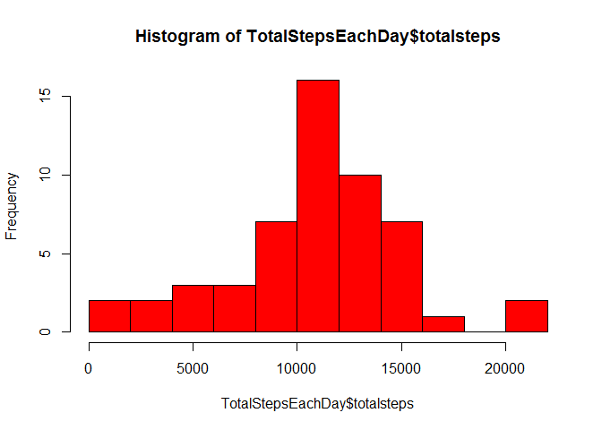
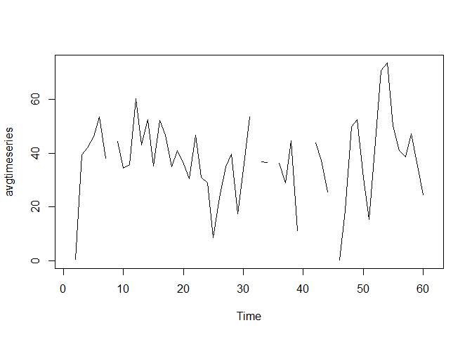
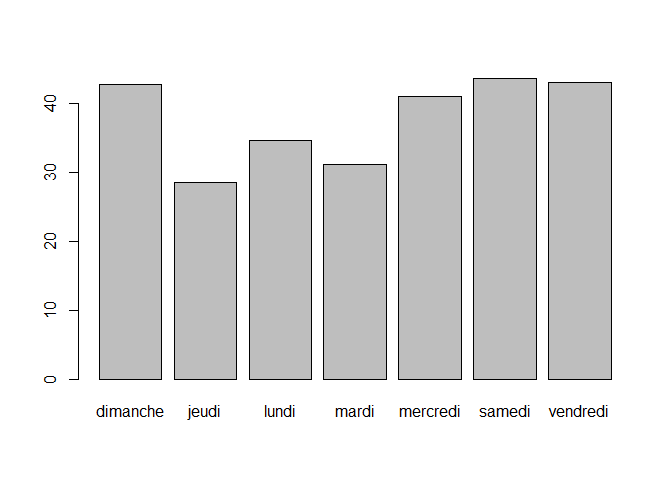

    #load library
    library(sqldf,warn.conflicts = FALSE, quietly = TRUE)

    ## Warning: package 'sqldf' was built under R version 3.2.5

    ## Warning: package 'gsubfn' was built under R version 3.2.5

    ## Warning: package 'proto' was built under R version 3.2.3

    ## Warning: package 'RSQLite' was built under R version 3.2.5

    ## Warning: package 'DBI' was built under R version 3.2.5

    #Code for reading in the dataset and/or processing the data
    MyData <- read.csv(file="activity.csv", header=TRUE, sep=",")
    MyData$steps<-as.numeric(MyData$steps) # convert steps to numeric

    #Histogram of the total number of steps taken each day
    TotalStepsEachDay <- sqldf("SELECT date,sum(steps) as totalsteps 
                                FROM MyData  
                                    group by date")

    ## Loading required package: tcltk

    TotalStepsEachDay$totalsteps<-as.numeric(TotalStepsEachDay$totalsteps) # convert steps to numeric
    hist(TotalStepsEachDay$totalsteps,breaks=10,col = "red")

    #Mean and median number of steps taken each day
    median(TotalStepsEachDay$totalsteps,na.rm = TRUE)

    ## [1] 10765

    mean(TotalStepsEachDay$totalsteps,na.rm = TRUE)

    ## [1] 10766.19

    #Time series plot of the average number of steps taken
    AvgStepsEachDay <- sqldf("SELECT date,avg(steps) as Avgsteps 
                                FROM MyData  
                               group by date")

    avgtimeseries <- ts(AvgStepsEachDay$Avgsteps)
    plot.ts(avgtimeseries)

    #The 5-minute interval that, on average, contains the maximum number of steps
    MaxSteps <-sqldf("SELECT max(steps) FROM MyData")
    Interval <-sprintf("SELECT interval FROM MyData where steps = %s", MaxSteps)
    sqldf(Interval)

    ##   interval
    ## 1      615

    #Code to describe and show a strategy for imputing missing data
    MyData2<-MyData[complete.cases(MyData),] #remove all records with missing values

    #Histogram of the total number of steps taken each day after missing values are imputed
    TotalStepsEachDay2 <- sqldf("SELECT date,sum(steps) as totalsteps 
                                FROM MyData2  
                               group by date")
    TotalStepsEachDay2$totalsteps<-as.numeric(TotalStepsEachDay2$totalsteps) # convert steps to numeric
    hist(TotalStepsEachDay2$totalsteps,breaks=10,col = "red")

    #Panel plot comparing the average number of steps taken per 5-minute interval across weekdays and weekends
    MyData2$days<-weekdays(as.Date(MyData2$date,'%Y-%m-%d'))

    AvgStepsWeekdays <- sqldf("SELECT days,avg(steps) as avgsteps 
                                FROM MyData2 GROUP BY days
                              ")
    barplot(AvgStepsWeekdays$avgsteps,names.arg = AvgStepsWeekdays$days)

